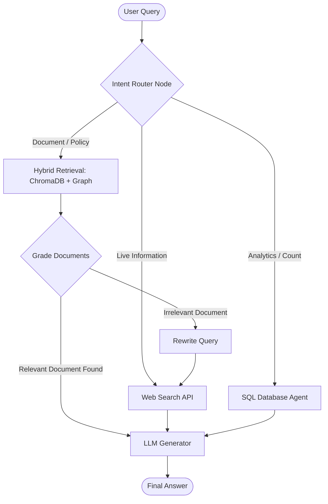

# Production-Ready Agentic RAG (Corrective & Routed RAG)


## 📌 Overview
This project implements an **Enterprise-Grade Agentic Retrieval-Augmented Generation (RAG)** system. Rather than relying on a naive vector-search approach, the system utilizes a **LangGraph-based control flow** to route queries based on user intent and perform self-correction if the retrieved documents lack relevance. 

Designed with extensive **MLOps and DevOps best practices**, the repository features complete infrastructure-as-code (IaC), containerization, CI/CD pipelines, and data version control, making it a scalable blueprint for real-world AI applications.

---

## The Real-World Problem
Most standard RAG pipelines suffer from two major flaws in production:
1. **The "One Size Fits All" Problem**: Naive RAG forces every user question through an Embedding/Vector database. This works great for unstructured PDFs but completely fails when a user asks for structured analytics (e.g., *"How many users signed up today?"*) or live data (e.g., *"What is the weather?"*).
2. **Hallucinations from Bad Retrieval**: If the vector database returns irrelevant chunks, the LLM usually tries to answer anyway, resulting in confident hallucinations. 

## The Solution
This project solves these issues by introducing an **Intent Router** and a **Corrective Fallback Mechanism** (CRAG):
* **Intent Routing**: Queries are first analyzed by an LLM router. Document queries go to the Vector DB, analytic queries go to an SQL agent, and live-data queries hit Web Search APIs.
* **Self-Reflection (Grading)**: Retrieved documents are evaluated for relevance. If they are irrelevant, the system autonomously **rewrites the query** and falls back to a targeted web search to prevent hallucinations.

---

## Architecture & Code Flow



### 1. **`src/agent/graph.py` (The Brain)**
Defines the `StateGraph`. The agent maintains conversation state and loops through:
- **Routing**: Vector vs. Web vs. SQL.
- **Retrieval**: Uses a custom hybrid retriever (BM25 + Semantic Search).
- **Grading & Correction**: Validates document relevance and grounds the generation to prevent hallucinations.

---

## Project Layout & MLOps Structure

A core focus of this project is maintainability and scalability for ML Engineering teams:

```text
├── api/                  # FastAPI backend serving the LangGraph agent
├── configs/              # Centralized hyperparameters (model, data, config)
├── data/                 # ChromaDB, Raw text, and Fine-Tuned Domain Embeddings
├── dvc.yaml & params.yaml# Data Version Control pipelines for tracking datasets
├── mlflow/               # MLflow tracking for embedding model experimentation
├── src/                  
│   ├── agent/            # LangGraph routing, retrieval, and generation logic
│   ├── data/             # Ingestion and Preprocessing pipelines
│   ├── models/           # Custom model evaluation and training scripts
│   └── monitoring/       # Data drift detection and performance metrics
├── tests/                # Unit tests and RAG Evaluation tools (Ragas)
```

---

## DevOps & Cloud-Native CI/CD

To ensure cost-efficiency during development while remaining production-ready, this project adopts a **"Dry-Run" Cloud strategy**.

* **Containerized Workloads (`Dockerfile`, `docker-compose.yml`)**: Complete environment isolation for local testing.
* **Kubernetes Orchestration (`k8s/`)**: Contains manifests for Deployments, Services, and Horizontal Pod Autoscalers (HPA) to handle traffic spikes.
* **Infrastructure as Code (`terraform/`)**: Defines the required cloud infrastructure (e.g., VPCs, EKS/GKE clusters) declaratively.
* **GitHub Actions (`.github/workflows/`)**: 
  - **CI Pipeline**: Syntax checks and mocked unit tests.
  - **CD Pipeline**: Performs `terraform validate` and `kubectl apply --dry-run` to mathematically prove the cloud infrastructure and orchestration manifests are flawless, without incurring unnecessary cloud provider costs.

---

## 💻 How to Run Locally

1. **Clone and Install:**
   ```bash
   git clone https://github.com/your-username/CRAG.git
   cd CRAG
   pip install -r requirements.txt
   ```
2. **Set Environment Variables:**
   Create a `.env` file and add your keys (e.g., `GOOGLE_API_KEY`, `TAVILY_API_KEY`).

3. **Run the Graph (Terminal Mode):**
   ```bash
   python src/agent/graph.py
   ```

4. **Run via Docker (Full Stack):**
   ```bash
   docker-compose up --build
   ```
   *(This spins up the FastAPI backend and necessary vector databases)*
