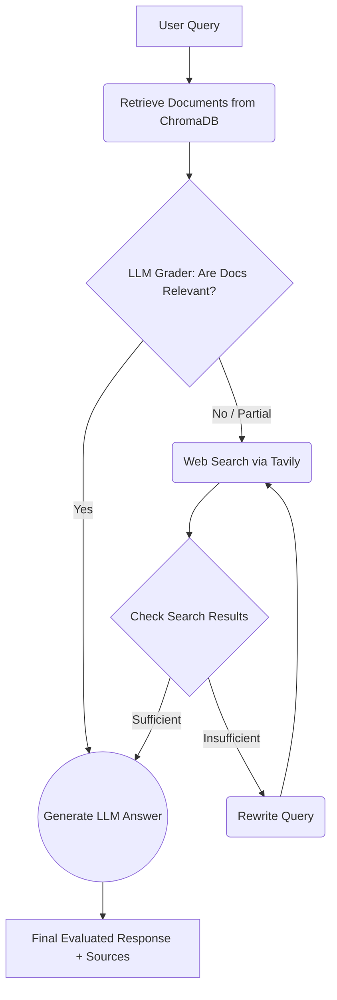

# 🔍 Agentic CRAG (Corrective RAG) System

[](https://www.python.org/downloads/release/python-3100/)
[](https://github.com/langchain-ai/langchain)
[](https://streamlit.io/)
[](https://deepmind.google/technologies/gemini/)
[](https://www.docker.com/)

A production-ready **Corrective Retrieval-Augmented Generation (CRAG)** application built with **LangGraph** and **Streamlit**. 

Unlike standard RAG pipelines that blindly rely on retrieved context—even when it's poor or irrelevant—this agentic workflow **self-evaluates** the quality of its retrieval. If the local document context is insufficient, it autonomously falls back to a live web search (via Tavily) and iteratively rewrites queries to find the correct information.

## ✨ Key Features

- **Agentic Orchestration (LangGraph):** State-machine driven workflow that enforces robust logic (Retrieve ➡️ Grade ➡️ Generate / Web Fallback).
- **Self-Correction & Mitigation:** Uses an LLM Grader to score document relevance, minimizing hallucination outputs.
- **Dynamic Query Rewriting:** If web search fails initially, the agent autonomously rewrites the search query to yield better results.
- **Semantic Caching:** Zero-latency responses for repeated semantic queries, severely reducing API costs.
- **Robust Memory:** Maintains conversational history for multi-turn Q&A context.
- **Verifiable Output:** LLM generations provide **explicit inline citations** linked directly to source documents and page numbers.
- **Observable & Deployable:** Easily monitored with **LangSmith Tracing** and fully containerized with **Docker** for cloud deployment.

## 🧠 System Architecture



## 🛠 Tech Stack

- **Orchestration:** LangGraph, LangChain
- **LLM:** Google Gemini (`gemini-2.5-flash`)
- **Embeddings:** HuggingFace (`all-MiniLM-L6-v2`)
- **Vector Database:** ChromaDB (Local SQLite)
- **Web Search API:** Tavily
- **Frontend UI:** Streamlit
- **DevOps:** Docker, LangSmith

## 🚀 Getting Started

### Prerequisites
Make sure you have an API key for **Google Gemini** and **Tavily**. 

### 1. Bare-metal Installation
```bash
# Clone the repository
git clone https://github.com/your-username/CRAG.git
cd CRAG

# Install dependencies
pip install -r requirements.txt

# Set your environment variables
echo "GOOGLE_API_KEY=your_gemini_key" >> .env
echo "TAVILY_API_KEY=your_tavily_key" >> .env
echo "LANGCHAIN_TRACING_V2=true" >> .env
echo "LANGCHAIN_API_KEY=your_langsmith_key" >> .env

# Run the app
streamlit run app.py
```

### 2. Docker Deployment
```bash
# Build the image
docker build -t crag-agent .

# Run the container (mapping ports and passing local .env)
docker run -p 8501:8501 --env-file .env crag-agent
```

## 💡 How to Use

1. **Upload Documents:** Use the sidebar to upload any PDF. It will be immediately chunked and embedded into the local ChromaDB.
2. **Chat with the Agent:** Ask highly specific questions about the document. 
3. **Observe the Agent:** The Streamlit UI will display the LangGraph state transitions in real time (`Retrieving...`, `Grading...`, `Web Searching...`, etc.).
4. **Verify Sources:** Check the `### References` generated at the bottom of responses, or expand the "Show Sources" accordion to view the raw snippet chunks used.

## 🔜 Future Roadmap

- Integrate **LangGraph Checkpointers** for robust, cross-session thread memory.
- Implement **Ragas** (Retrieval Augmented Generation Assessment) offline evaluation scripts.
- Support multimodal document ingestion (images, charts).