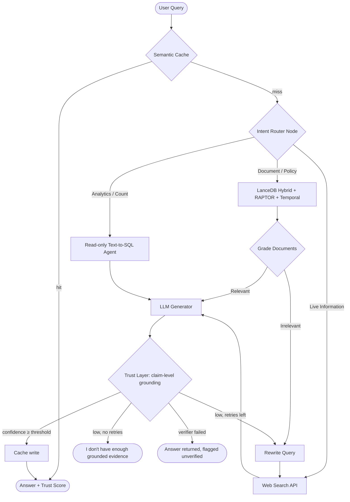

# Agentic Knowledge Engine (Beyond Corrective RAG)


## 📌 Overview
This started as a Corrective + Routed RAG (CRAG) system and goes **beyond it**: instead of a
flat retrieval pipeline, it is an **Agentic Knowledge Engine** that (1) indexes knowledge at
**multiple resolutions**, (2) is **time-aware** about when facts were true, and (3) only
answers what it can **prove** — reporting a trust score and **abstaining** when grounding is
weak. The control flow is a **LangGraph** state machine; retrieval is **LanceDB hybrid search**.

### What makes this more than a CRAG
| Capability | What it does | Where |
|---|---|---|
| 🌲 **RAPTOR hierarchical indexing** | Recursively clusters + summarizes chunks into a tree; retrieves at multiple resolutions (leaf detail ↔ summary overview) | `src/index/raptor.py` |
| 🗄️ **LanceDB vector store** | Embedded, versioned store with **native hybrid** (vector + full-text) search — replaces Chroma + hand-rolled BM25/RRF | `src/index/vectorstore.py` |
| ⏳ **Temporal knowledge (Pillar A)** | Point-in-time (`as_of`) queries, "what changed" reasoning, automatic **staleness flags** on evidence | `vectorstore.py`, `nodes.py` |
| 🔎 **Verifiable trust layer (Pillar B)** | Claim-level grounding check → **confidence score** and **abstention** instead of confident hallucination | `src/agent/trust.py` |
| 🧱 **Config-driven, modular code** | `configs/config.yaml` is the single source of truth; the 417-line monolith is split into small typed modules | `src/core/`, `src/agent/` |

---

## The Real-World Problem
Most standard RAG pipelines suffer from two major flaws in production:
1. **The "One Size Fits All" Problem**: Naive RAG forces every user question through an Embedding/Vector database. This works great for unstructured PDFs but completely fails when a user asks for structured analytics (e.g., *"How many users signed up today?"*) or live data (e.g., *"What is the weather?"*).
2. **Hallucinations from Bad Retrieval**: If the vector database returns irrelevant chunks, the LLM usually tries to answer anyway, resulting in confident hallucinations. 

## The Solution
This project solves these issues by introducing an **Intent Router** and a **Corrective Fallback Mechanism** (CRAG):
* **Intent Routing**: Queries are first analyzed by an LLM router. Document queries go to the Vector DB, analytic queries go to an SQL agent, and live-data queries hit Web Search APIs.
* **Self-Reflection (Grading)**: Retrieved documents are evaluated for relevance. If they are irrelevant, the system autonomously **rewrites the query** and falls back to a targeted web search to prevent hallucinations.

---

## Architecture & Code Flow



### Code map
- **`src/agent/graph.py`** — graph wiring only (~80 lines); node logic lives in `src/agent/nodes.py`.
- **`src/core/config.py`** — typed settings loaded once from `configs/config.yaml` (no hardcoded `k`/paths).
- **`src/core/embeddings.py`** — one shared embedder for retriever + cache.
- **`src/index/vectorstore.py`** — LanceDB hybrid store with temporal `as_of` + source-ACL filters.
- **`src/index/raptor.py`** — RAPTOR tree builder (GMM clustering + LLM summaries).
- **`src/agent/trust.py`** — verifiable trust layer (claim grounding → confidence → abstain / unverified). Fails *safe*.
- **`src/agent/sql_tool.py`** — read-only text-to-SQL agent over a seeded SQLite analytics DB (write-guarded).
- **`src/agent/semantic_cache.py`** — LanceDB semantic cache, wired into the graph as `cache_lookup` / `cache_write`.

### Build the index
```bash
python scripts/build_index.py path/to/doc.pdf [more.pdf ...]
```
Extracts (LlamaParse → PyPDF fallback), cleans/splits, builds a RAPTOR tree, and writes every
node (leaves + summaries) into LanceDB. The Streamlit uploader does the same via `src/index/builder.py`.

### Tests that run without API keys
```bash
PYTHONPATH=. python tests/test_vectorstore.py   # hybrid search, temporal, ACL, staleness
PYTHONPATH=. python tests/test_raptor.py        # hierarchical tree building
PYTHONPATH=. python tests/test_api.py           # API handler smoke test
```

---

## Project Layout & MLOps Structure

A core focus of this project is maintainability and scalability for ML Engineering teams:

```text
├── api/                  # FastAPI backend serving the LangGraph agent
├── configs/              # Centralized hyperparameters (model, data, config)
├── data/                 # LanceDB (knowledge base + semantic cache), analytics.db, Fine-Tuned Domain Embeddings
├── dvc.yaml & params.yaml# Data Version Control pipelines for tracking datasets
├── mlflow/               # MLflow tracking for embedding model experimentation
├── src/                  
│   ├── agent/            # LangGraph routing, retrieval, and generation logic
│   ├── data/             # Ingestion and Preprocessing pipelines
│   ├── models/           # Custom model evaluation and training scripts
│   └── monitoring/       # Data drift detection and performance metrics
├── tests/                # Unit tests and RAG Evaluation tools (Ragas)
```

---

## DevOps & Cloud-Native CI/CD

To ensure cost-efficiency during development while remaining production-ready, this project adopts a **"Dry-Run" Cloud strategy**.

* **Containerized Workloads (`Dockerfile`, `docker-compose.yml`)**: Complete environment isolation for local testing.
* **Kubernetes Orchestration (`k8s/`)**: Contains manifests for Deployments, Services, and Horizontal Pod Autoscalers (HPA) to handle traffic spikes.
* **Infrastructure as Code (`terraform/`)**: Defines the required cloud infrastructure (e.g., VPCs, EKS/GKE clusters) declaratively.
* **GitHub Actions (`.github/workflows/`)**: 
  - **CI Pipeline**: Syntax checks and mocked unit tests.
  - **CD Pipeline**: Performs `terraform validate` and `kubectl apply --dry-run` to mathematically prove the cloud infrastructure and orchestration manifests are flawless, without incurring unnecessary cloud provider costs.

---

## 💻 How to Run Locally

1. **Clone and Install:**
   ```bash
   git clone https://github.com/your-username/CRAG.git
   cd CRAG
   pip install -r requirements.txt
   ```
2. **Set Environment Variables:**
   Create a `.env` file and add your keys (e.g., `GOOGLE_API_KEY`, `TAVILY_API_KEY`).

3. **Run the Graph (Terminal Mode):**
   ```bash
   python src/agent/graph.py
   ```

4. **Run via Docker (Full Stack):**
   ```bash
   docker-compose up --build
   ```
   *(This spins up the FastAPI backend and necessary vector databases)*
